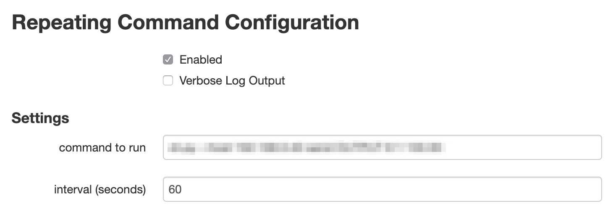

# OctoPrint_RepeatingCommand

Runs a command at a specified interval during prints.

I use it to trigger my home automation to run an exhaust fan (that normally turns off after 5 minutes) when printing.

## Installation

Install via the bundled [Plugin Manager](https://github.com/foosel/OctoPrint/wiki/Plugin:-Plugin-Manager)
or manually using this URL:

    https://github.com/aerickson/OctoPrint_RepeatingCommand/archive/master.zip

## Configuration

Set a command and interval and enable it.

## Acknowledgements

Loosely based on [OctoPrint_FreeMobile-Notifier](https://github.com/Pinaute/OctoPrint_FreeMobile-Notifier).

## License

Licensed under the terms of the [AGPLv3](http://opensource.org/licenses/AGPL-3.0).
