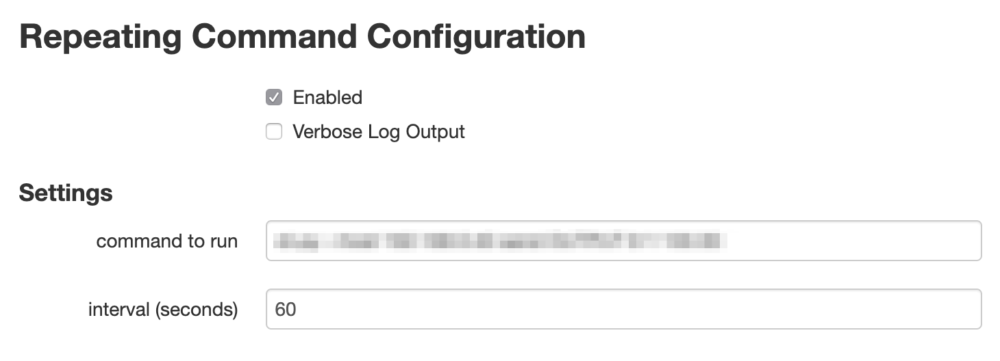

# OctoPrint_RepeatingCommand

Runs a command at a specified interval during prints.

I use it to trigger my home automation to run an exhaust fan (that normally turns off after 5 minutes) when printing.

## Installation

Install via the bundled [Plugin Manager](https://github.com/foosel/OctoPrint/wiki/Plugin:-Plugin-Manager)
or manually using this URL:

    https://github.com/aerickson/OctoPrint_RepeatingCommand/archive/master.zip

For editable development installs, use the Python environment that runs
OctoPrint:

    python -m pip install -e .

## Configuration

Set a command and interval and enable it.

The optional alternate profile is selected when the current `M117` message
contains one of the configured comma-separated substrings (case-insensitive), or
when the printer state matches one of the configured comma-separated state IDs.
For example, set the M117 text to `cooling`, the alternate interval to `10`, and
optionally provide a different command. A blank alternate command reuses the
normal command. This is not tied to a particular printer state: it can be used
for any M117 text or state your printer reports, including `Printing`.

The cooling profile can continue running after `PrintDone` while the cooling
condition remains active. Clear the `M117` message or leave the configured cooling
state to return to the normal profile or stop the timer.

### Rules

The settings page supports up to six rules. Each rule has its own command and
interval. A rule applies to all situations by default; enable filtering to make
it apply only when its M117 status text or printer-state filters match. Filtered
rules take precedence over all-situations rules, and rules are evaluated from top
to bottom. This makes the first unfiltered rule a useful fallback.

## Testing

Run the backend unit tests with:

    python -m pytest -q

Run all automated test suites and checks with:

    ./run-tests.sh

With [uv](https://docs.astral.sh/uv/), create or update the project environment
and run the backend tests with:

    uv sync
    uv run pytest -q

Run the frontend viewmodel tests with:

    node test/repeatingcommand_viewmodel_smoke.js

For an existing OctoPrint virtual environment, install the Python test tools
without replacing that environment:

    source ~/OctoPrint/bin/activate
    uv pip install -r requirements-test.txt
    pytest -q

Additional syntax checks are available with:

    python -m py_compile octoprint_repeatingcommand/__init__.py
    python test/jinja_syntax_check.py
    node --check octoprint_repeatingcommand/static/js/repeatingcommand.js

The backend tests use lightweight OctoPrint fakes and do not require a running
OctoPrint server or a connected printer.

## Acknowledgements

Loosely based on [OctoPrint_FreeMobile-Notifier](https://github.com/Pinaute/OctoPrint_FreeMobile-Notifier).

## License

Licensed under the terms of the [AGPLv3](http://opensource.org/licenses/AGPL-3.0).
